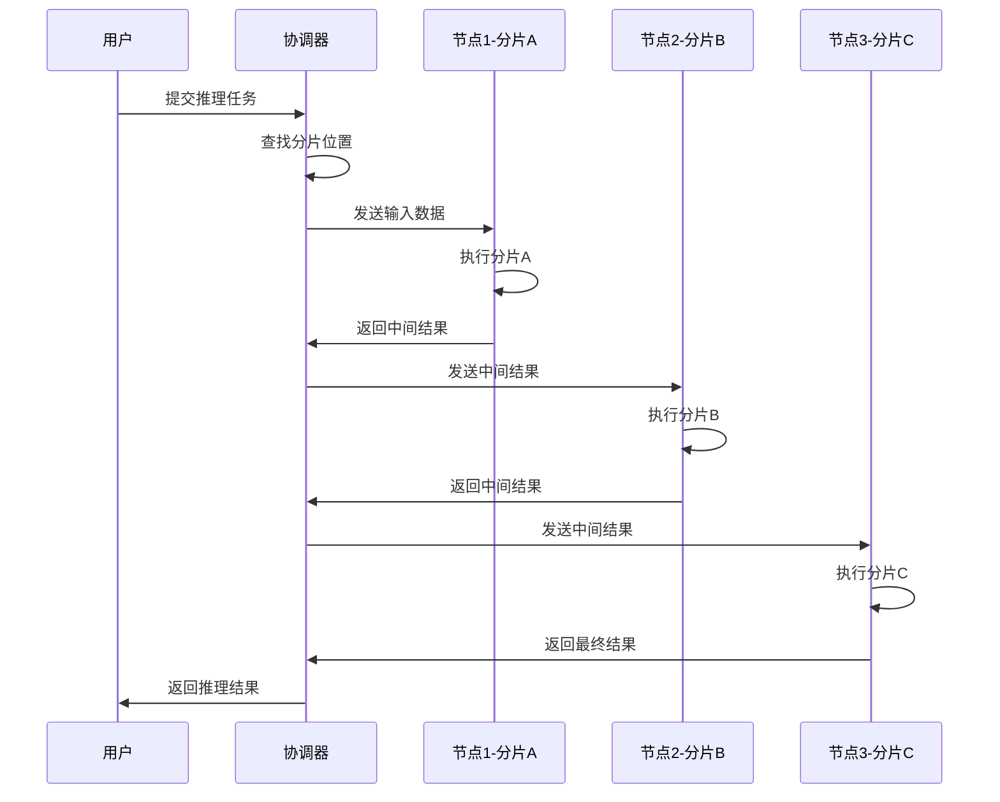
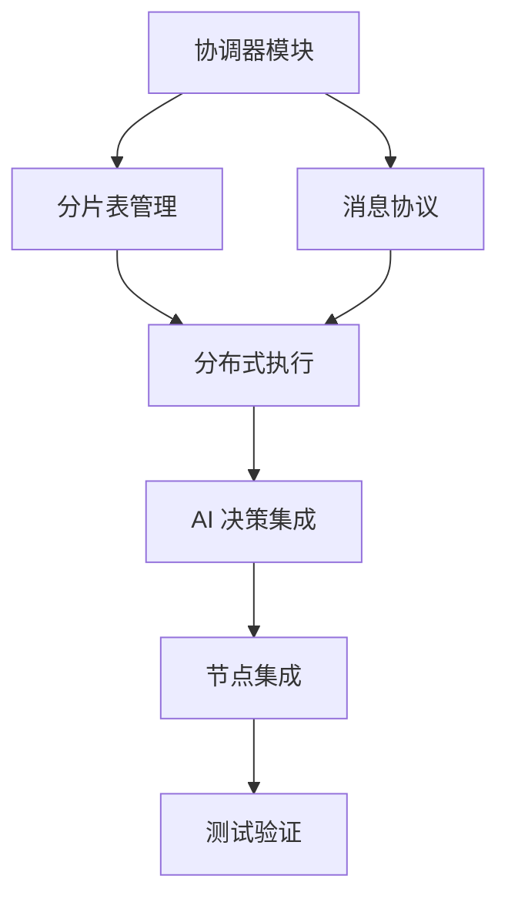

# 分布式推理协调器实施计划

## 一、现状分析

### 已有基础设施

项目中已经存在一个相当完整的去中心化计算网络实现：

**[`src/agent/compute/decentralized_compute.rs`](src/agent/compute/decentralized_compute.rs)**

```rust
pub struct DecentralizedComputeNetwork {
    node_id: String,
    gpu_manager: Arc<GpuManager>,
    task_scheduler: Arc<TaskScheduler>,
    result_aggregator: Arc<ResultAggregator>,
    incentive_system: Arc<IncentiveSystem>,
    network_state: Arc<RwLock<NetworkState>>,
    message_handler: Arc<MessageHandler>,
    connection_manager: Arc<Mutex<Option<Arc<IrohConnectionManager>>>>,
    is_running: Arc<RwLock<bool>>,
}
```

**已实现的功能**：
- ✅ 任务调度器（优先级队列）
- ✅ 结果聚合器（多种策略）
- ✅ 激励机制（贡献记录、声誉评分）
- ✅ 消息处理器（网络消息）
- ✅ 心跳服务（节点状态）
- ✅ 任务切分（数据并行）

### 缺失的关键功能

| 功能 | 状态 | 说明 |
|------|------|------|
| 模型分片协调 | ❌ 缺失 | 需要与 `model_splitter` 集成 |
| 分片分发跟踪 | ❌ 缺失 | 需要跟踪每个分片在哪个节点 |
| 分布式推理执行 | ❌ 缺失 | 需要协调多节点按顺序执行 |
| 中间结果传递 | ❌ 缺失 | 节点间传递激活值 |
| 结果合并 | ⚠️ 部分 | 有聚合器但缺少推理特定逻辑 |

---

## 二、实施方案

### 新增模块：`src/compute/coordinator.rs`

创建一个专门的分布式推理协调器：

```rust
/// 分布式推理协调器
pub struct DistributedInferenceCoordinator {
    /// 本地节点 ID
    node_id: String,
    /// 模型分片表（分片 ID -> 节点 ID）
    shard_table: Arc<RwLock<HashMap<String, String>>>,
    /// 分片执行顺序
    execution_order: Arc<RwLock<Vec<String>>>,
    /// 中间结果缓存
    intermediate_cache: Arc<RwLock<HashMap<String, Tensor>>>,
    /// 节点连接管理
    connection_manager: Arc<IrohConnectionManager>,
    /// AI 决策引擎（用于智能调度）
    ai_decision: Arc<AIDecisionEngine>,
}

/// 推理任务状态
pub struct InferenceTaskState {
    pub task_id: String,
    pub model_id: String,
    pub input_data: Vec<u8>,
    pub current_shard: usize,
    pub intermediate_results: Vec<Tensor>,
    pub status: InferenceStatus,
}

/// 推理状态
pub enum InferenceStatus {
    Pending,
    Running { current_node: String },
    WaitingForIntermediate { from_node: String },
    Completed,
    Failed(String),
}
```

### 核心工作流程



---

## 三、详细实施步骤

### 步骤 1：创建协调器模块

**文件**：`src/compute/mod.rs` 和 `src/compute/coordinator.rs`

```rust
// src/compute/mod.rs
pub mod coordinator;
pub use coordinator::{DistributedInferenceCoordinator, InferenceTaskState};
```

### 步骤 2：实现分片表管理

```rust
impl DistributedInferenceCoordinator {
    /// 注册模型分片
    pub async fn register_model_shards(
        &mut self,
        model_id: &str,
        shards: Vec<ShardInfo>,
    ) -> Result<(), String> {
        let mut table = self.shard_table.write().await;
        let mut order = self.execution_order.write().await;
        
        for shard in shards {
            table.insert(shard.shard_id.clone(), shard.node_id.clone());
            order.push(shard.shard_id.clone());
        }
        
        Ok(())
    }
    
    /// 查找分片所在节点
    pub async fn locate_shard(&self, shard_id: &str) -> Option<String> {
        self.shard_table.read().await.get(shard_id).cloned()
    }
}
```

### 步骤 3：实现分布式推理执行

```rust
impl DistributedInferenceCoordinator {
    /// 执行分布式推理
    pub async fn execute_inference(
        &mut self,
        task: InferenceTaskState,
    ) -> Result<Vec<u8>, String> {
        let order = self.execution_order.read().await.clone();
        let mut current_data = task.input_data;
        
        for shard_id in order {
            // 查找分片所在节点
            let node_id = self.locate_shard(&shard_id).await
                .ok_or_else(|| format!("Shard {} not found", shard_id))?;
            
            // 发送数据到目标节点执行
            let result = self.execute_on_node(&node_id, &shard_id, &current_data).await?;
            
            // 更新中间结果
            current_data = result;
        }
        
        Ok(current_data)
    }
    
    /// 在指定节点执行分片
    async fn execute_on_node(
        &self,
        node_id: &str,
        shard_id: &str,
        input_data: &[u8],
    ) -> Result<Vec<u8>, String> {
        // 构建执行消息
        let message = InferenceMessage::ExecuteShard {
            shard_id: shard_id.to_string(),
            input_data: input_data.to_vec(),
        };
        
        // 发送到目标节点
        self.send_to_node(node_id, message).await?;
        
        // 等待结果
        self.wait_for_result(shard_id).await
    }
}
```

### 步骤 4：集成 AI 决策引擎

```rust
impl DistributedInferenceCoordinator {
    /// 使用 AI 决策优化分片调度
    pub async fn optimize_shard_schedule(&mut self) -> Result<(), String> {
        let context = ExecutionContext {
            iteration: 0,
            completed_steps: vec![],
            current_step: Some("optimize_schedule".to_string()),
            execution_history: vec![],
            learned_knowledge: serde_json::json!({}),
            acceptance_criteria: vec![],
        };
        
        let decision = self.ai_decision.make_autonomous_decision(
            context,
            &self.api_key,
            &self.api_base,
            &self.model,
        ).await?;
        
        // 根据 AI 决策调整调度
        if decision.decision_type == "rebalance_shards" {
            self.rebalance_shards(&decision.parameters).await?;
        }
        
        Ok(())
    }
}
```

### 步骤 5：与现有模块集成

修改 [`src/node.rs`](src/node.rs) 添加协调器：

```rust
pub struct Node {
    // ... 现有字段 ...
    
    /// 分布式推理协调器
    inference_coordinator: Option<DistributedInferenceCoordinator>,
}

impl Node {
    pub async fn new(config: AppConfig) -> Result<Self> {
        // ... 现有初始化 ...
        
        // 初始化推理协调器
        let inference_coordinator = if config.enable_distributed_inference {
            Some(DistributedInferenceCoordinator::new(
                comms.node_id().to_string(),
                ai_decision_engine.clone(),
            ).await?)
        } else {
            None
        };
        
        Ok(Self {
            // ... 现有字段 ...
            inference_coordinator,
        })
    }
}
```

---

## 四、消息协议定义

### 推理消息类型

```rust
/// 推理消息
#[derive(Debug, Clone, Serialize, Deserialize)]
pub enum InferenceMessage {
    /// 执行分片请求
    ExecuteShard {
        shard_id: String,
        input_data: Vec<u8>,
    },
    /// 执行结果
    ExecutionResult {
        shard_id: String,
        output_data: Vec<u8>,
        metrics: ExecutionMetrics,
    },
    /// 分片注册
    RegisterShard {
        model_id: String,
        shard_id: String,
        shard_info: ShardInfo,
    },
    /// 分片查询
    QueryShard {
        shard_id: String,
    },
    /// 分片位置响应
    ShardLocation {
        shard_id: String,
        node_id: String,
    },
}

/// 分片信息
#[derive(Debug, Clone, Serialize, Deserialize)]
pub struct ShardInfo {
    pub shard_id: String,
    pub node_id: String,
    pub layer_range: (usize, usize),
    pub size_bytes: u64,
    pub checksum: String,
}
```

---

## 五、配置扩展

### 添加到 `AppConfig`

```rust
// src/config.rs

/// 分布式推理配置
#[derive(Debug, Clone, Serialize, Deserialize)]
pub struct DistributedInferenceConfig {
    /// 是否启用分布式推理
    pub enabled: bool,
    /// 最大并行分片数
    pub max_parallel_shards: usize,
    /// 中间结果缓存大小（MB）
    pub cache_size_mb: usize,
    /// 节点超时时间（秒）
    pub node_timeout_secs: u64,
    /// 重试次数
    pub max_retries: u32,
    /// 是否启用 AI 优化调度
    pub enable_ai_scheduling: bool,
}

impl Default for DistributedInferenceConfig {
    fn default() -> Self {
        Self {
            enabled: true,
            max_parallel_shards: 4,
            cache_size_mb: 1024,
            node_timeout_secs: 60,
            max_retries: 3,
            enable_ai_scheduling: true,
        }
    }
}
```

---

## 六、测试计划

### 单元测试

```rust
#[cfg(test)]
mod tests {
    use super::*;
    
    #[tokio::test]
    async fn test_shard_registration() {
        let mut coordinator = DistributedInferenceCoordinator::new_test().await;
        
        let shards = vec![
            ShardInfo {
                shard_id: "shard_0".to_string(),
                node_id: "node_1".to_string(),
                layer_range: (0, 10),
                size_bytes: 1024,
                checksum: "abc123".to_string(),
            },
        ];
        
        coordinator.register_model_shards("model_1", shards).await.unwrap();
        
        assert_eq!(coordinator.locate_shard("shard_0").await, Some("node_1".to_string()));
    }
    
    #[tokio::test]
    async fn test_inference_execution() {
        // 测试分布式推理执行流程
    }
}
```

### 集成测试

```bash
# 启动多节点测试
cargo test --test distributed_inference_test
```

---

## 七、实施优先级

| 优先级 | 任务 | 预计工作量 |
|--------|------|------------|
| P0 | 创建协调器基础结构 | 中 |
| P0 | 实现分片表管理 | 小 |
| P1 | 实现分布式推理执行 | 大 |
| P1 | 集成 AI 决策引擎 | 中 |
| P2 | 添加配置支持 | 小 |
| P2 | 编写测试 | 中 |

---

## 八、依赖关系



---

## 九、下一步行动

1. **创建 `src/compute/` 目录和基础模块**
2. **实现 `DistributedInferenceCoordinator` 核心结构**
3. **添加分片表管理功能**
4. **实现推理消息协议**
5. **集成到现有 Node 结构**
6. **编写测试用例**

是否需要我开始实施这个计划？如果是，请确认是否需要调整任何部分。
