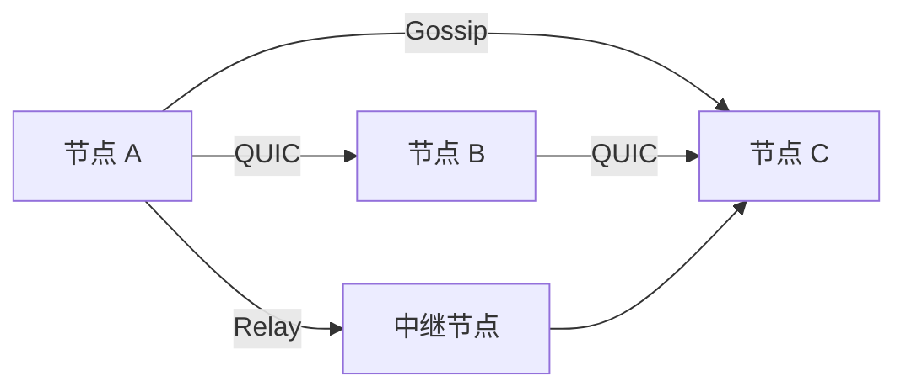
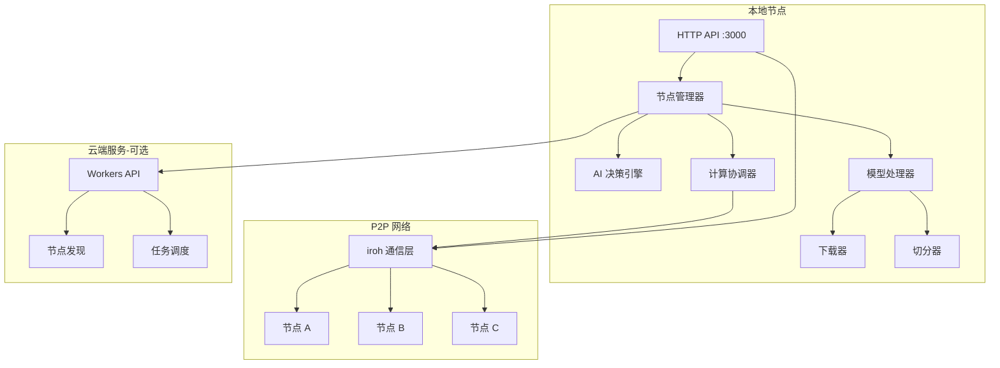

# Williw MVP 架构分析与改进计划

## 一、当前架构分析

### 1. 项目整体结构

```
williw-master/
├── src/
│   ├── main.rs              # 主入口
├── ├── lib.rs               # 库入口
├── ├── node.rs              # 节点核心逻辑
├── ├── ai_decision.rs       # AI 决策引擎
├── ├── comms/               # 通信模块
│   ├── core/                # 核心通信（handle, config）
│   ├── p2p/                 # P2P 分发（sender, receiver, distributor）
│   ├── frontend/            # 前端管理器
│   ├── transport/           # 传输层（iroh 集成）
│   └── monitoring/          # 监控仪表板
├── ├── agent/               # AI Agent 模块
│   ├── tools/               # 工具集
│   ├── workflow/            # 工作流
│   └── compute/             # 计算管理
├── ├── models/              # 模型处理
│   ├── model_downloader/    # 模型下载
│   ├── model_splitter/      # 模型切分
│   └── metadata_uploader/   # 元数据上传
└── └── ...
```

### 2. 端口和 API 配置现状

| 功能 | 端口 | 配置位置 | 状态 |
|------|------|----------|------|
| QUIC 通信 | 9234 + node_id | `src/args.rs` | ✅ 已实现 |
| 推理服务器 | 8000 | `src/agent/setup/setup_tasks.rs` | ✅ 已实现 |
| IPFS API | 5001 | `src/agent/tools/mod.rs` | ⚠️ 外部依赖 |
| IPFS Gateway | 8080 | `src/agent/utils.rs` | ⚠️ 外部依赖 |
| **管理 API** | - | - | ❌ 缺失 |
| **WebSocket** | - | - | ❌ 缺失 |

### 3. Workers 后端模块状态

**问题发现**：在 [`src/lib.rs:21-22`](src/lib.rs:21) 中声明了 workers 模块：

```rust
#[cfg(feature = "workers")]
pub mod workers;
```

但 **没有找到 `src/workers` 目录**，这意味着：
- Cloudflare Workers 集成尚未实现
- 需要创建 workers 模块来提供云端协调服务

### 4. AI 决策管理分析

[`src/ai_decision.rs`](src/ai_decision.rs) 实现了文档驱动的 AI 决策引擎：

**优点**：
- 支持自主决策（无需硬编码决策类型）
- 文档驱动（AI 读取身份、任务、工具文档）
- 支持外部 AI API（DeepSeek 等）

**缺失**：
- 没有与 Workers 后端的集成
- 缺少实时状态推送机制
- 没有跨节点协调决策能力

### 5. 节点通信机制

使用 **iroh** 作为 P2P 通信协议：



**当前支持的通信**：
- ✅ 节点发现（PeerDiscovered）
- ✅ 连接管理（ConnectionEstablished/Closed）
- ✅ 消息传递（Gossip, QUIC）
- ✅ 文件传输（P2PModelDistributor）

---

## 二、MVP 缺失功能分析

### 核心问题：缺少统一的协调服务

用户描述的 MVP 流程：
```
另一台电脑连接 → 共享算力 → 下载模型 → 切分 → 发送给邻近节点 → 共同运行
```

**当前缺失**：

| 步骤 | 当前状态 | 缺失内容 |
|------|----------|----------|
| 1. 另一台电脑连接 | ⚠️ 部分 | 缺少用户友好的连接入口（API/Web UI） |
| 2. 共享算力 | ⚠️ 部分 | 缺少算力注册和发现机制 |
| 3. 下载模型 | ✅ 已有 | `model_downloader` 模块 |
| 4. 切分模型 | ✅ 已有 | `model_splitter` 模块 |
| 5. 发送给邻近节点 | ✅ 已有 | `P2PModelDistributor` |
| 6. 共同运行 | ❌ 缺失 | 缺少分布式推理协调器 |

---

## 三、改进方案

### 方案 A：添加 HTTP API 服务层

创建一个 HTTP API 服务，让其他电脑可以通过 REST API 连接和管理：

```rust
// src/api/mod.rs
pub mod routes;
pub mod handlers;

// 主要端点
// GET  /api/node/info        - 获取节点信息
// POST /api/node/connect     - 连接到其他节点
// GET  /api/peers            - 获取已连接节点列表
// POST /api/model/download   - 下载模型
// POST /api/model/split      - 切分模型
// POST /api/model/distribute - 分发模型
// GET  /api/compute/status   - 获取计算状态
// POST /api/compute/start    - 启动分布式计算
```

**端口建议**：`3000` 或 `8080`

### 方案 B：实现 Workers 后端

创建 Cloudflare Workers 模块作为云端协调服务：

```rust
// src/workers/mod.rs
pub mod coordinator;
pub mod discovery;
pub mod scheduler;

// Workers 功能
// - 节点注册和发现
// - 算力调度
// - 任务分配
// - 状态同步
```

### 方案 C：分布式推理协调器

创建一个协调器来管理多节点共同运行：

```rust
// src/compute/coordinator.rs
pub struct DistributedComputeCoordinator {
    nodes: Vec<NodeInfo>,
    model_shards: HashMap<String, ModelShard>,
    task_queue: Vec<ComputeTask>,
}

impl DistributedComputeCoordinator {
    pub async fn distribute_task(&mut self, task: ComputeTask);
    pub async fn collect_results(&self) -> Vec<ComputeResult>;
    pub async fn sync_state(&self) -> NetworkState;
}
```

---

## 四、推荐实施路径

### 阶段 1：HTTP API 服务（优先级最高）

1. 创建 `src/api/` 模块
2. 使用 `axum` 或 `actix-web` 框架
3. 实现核心端点：
   - 节点信息和管理
   - 模型下载和切分
   - 计算任务管理

### 阶段 2：WebSocket 实时通信

1. 添加 WebSocket 支持
2. 实现实时状态推送
3. 支持前端 UI 连接

### 阶段 3：Workers 后端（可选）

1. 创建 D1 数据库 schema
2. 实现节点注册 API
3. 实现算力调度逻辑

### 阶段 4：分布式推理协调

1. 创建协调器模块
2. 实现任务分发逻辑
3. 实现结果收集和聚合

---

## 五、架构图



---

## 六、问题确认

在继续之前，需要确认以下问题：

1. **API 端口偏好**：HTTP API 使用哪个端口？（建议 3000 或 8080）

2. **Workers 后端优先级**：是否需要立即实现 Cloudflare Workers？还是先专注于本地 P2P 功能？

3. **前端 UI**：是否需要同时开发 Web 前端？还是先只提供 API？

4. **模型存储**：模型下载后存储在哪里？是否需要支持自定义路径？

5. **安全认证**：节点间连接是否需要认证机制？
